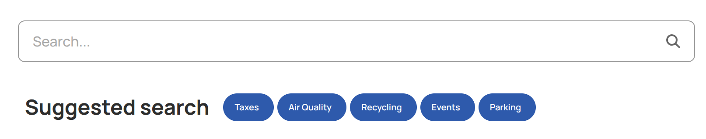
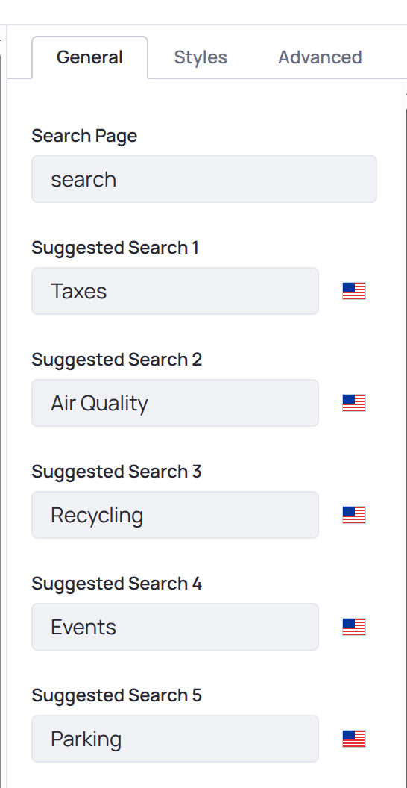

# Suggested Search

Fragment to be used next to a Search Bar (not included; you can use the standard one, or your own custom one). It can show up to 5 badges with pre-defined suggestions for the search.

Clicking on one of the badges, a search for that suggestion will be performed.

Configuration available to set a search page, and the caption for the badges. Badges are localizable (i18n).

